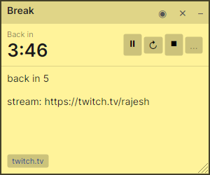
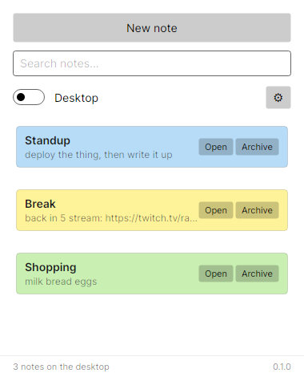

# YappyNotes

Desktop sticky notes for Ubuntu, Windows and macOS. Each note is its own window
that stays where you put it, saves itself as you type, and is still there after a
reboot. No account and no sync — everything lives in one SQLite file, and the only
thing it ever asks the network is whether a newer release exists (which you can
turn off).

Built with C# / .NET 10 and [Avalonia UI](https://avaloniaui.net), MVVM, and a
repository over SQLite.

| A note | The manager |
| --- | --- |
|  |  |

### How a keystroke becomes one `UPDATE`

Stepped, and four figures more, on the **[architecture
page](https://algorisys-oss.github.io/yappynotes/architecture.html)** — made with
**[tinyfly.app](https://tinyfly.app)**. This one loops in CSS instead, because a
GitHub README runs no JavaScript.

Nothing is ever saved by pressing a button, and nothing is saved per keystroke
either. That is the shape of most of this codebase. The other four figures are
the layers and the one arrow that must never exist, a timer session where the
write counter moves three times in eight minutes, why a countdown survives being
closed, and the repository contract answered twice.

> **Status: every milestone in [docs/plan.md](docs/plan.md) is done, Milestone 6's
> tray icon and rich text included.**
>
> All eight MMF items hold: notes live on the desktop as their own borderless
> windows — draggable, resizable, pinnable, recolourable — save themselves as you
> type, and come back where you left them. The manager lists and searches them and
> holds the archive. Settings, keyboard shortcuts, CI and packaging for six
> runtime identifiers are in.
>
> On top of that, a note can carry a stream timer — a countdown for "back in
> 5:00" or a count-up for how long you have been live — that pauses, resumes and
> restarts, whose label, length and direction are editable while it is stopped,
> and which survives closing the app.
>
> A note's text is Markdown, drawn formatted: headings, bullets, checklists you
> tick in place, bold, italic, `code`, and links — bare or labelled,
> http/https/mailto only — that open where they are written. Click the text to
> edit the Markdown, with the caret where you clicked; click away and it is
> formatted again. It is still stored as the plain text you typed.
>
> The app lives in the tray: closing the manager leaves it running, and the tray
> menu makes a new note, shows or hides every note, reopens the manager and quits.
> An installed copy keeps itself up to date: it checks GitHub on start, downloads
> a newer release, and offers to restart into it. It starts at login unless that
> is turned off, and starting it while it runs brings the running copy forward
> rather than opening a second.
>
> 526 green tests. Start at [LOOP.md](LOOP.md).

## Documentation

| File | What it is |
| --- | --- |
| [docs/plan.md](docs/plan.md) | What we are building, the architecture review, the milestones |
| [docs/architecture.html](docs/architecture.html) | The architecture with animated diagrams — open it in a browser |
| [LOOP.md](LOOP.md) | How we build it — the TDD loop and its rules |
| [TODO.md](TODO.md) | Noticed since the plan was written; not scheduled yet |
| [docs/sticky-notes-architecture.md](docs/sticky-notes-architecture.md) | The original whiteboard design, transcribed |
| [docs/sticky-notes-architecture.pdf](docs/sticky-notes-architecture.pdf) | The whiteboard drawing itself |
| [CLAUDE.md](CLAUDE.md) | Conventions, for Claude Code and for people |

## Prerequisites

**.NET 10 SDK.** The build is pinned to `10.0.302` in `global.json`, so that
exact SDK — or a later 10.0.3xx patch — must be installed.

    dotnet --list-sdks

If you do not have it, install from
[dot.net/download](https://dotnet.microsoft.com/download/dotnet/10.0), or on
Linux with the install script:

    curl -sSL https://dot.net/v1/dotnet-install.sh | bash -s -- --channel 10.0
    export PATH="$HOME/.dotnet:$PATH"        # add this to your shell profile

Having .NET 9 or 11 installed alongside is fine; `global.json` picks the right one.

**Linux desktop libraries.** Avalonia renders through Skia on X11 and needs a few
system libraries that a headless server image will not have:

    sudo apt install -y libx11-6 libice6 libsm6 libfontconfig1

Wayland sessions work through XWayland with no extra setup.

**Windows and macOS** need nothing beyond the SDK.

**No database to install.** SQLite is embedded — `Microsoft.Data.Sqlite` carries
the native library — so there is no server and no connection string.

## Project layout

    yappynotes.sln
    global.json                       SDK pin
    Directory.Build.props             version and shared build settings
    src/
      YappyNotes.Core/                domain, services, INoteRepository, UserPaths
      YappyNotes.Data/                SqliteNoteRepository, Migrator
      YappyNotes.ViewModels/          ManagerViewModel, NoteViewModel, IWindowManager
      YappyNotes.App/                 Avalonia views, WindowManager, bootstrap
    tests/
      YappyNotes.TestKit/             the fake and the INoteRepository contract
      YappyNotes.Core.Tests/
      YappyNotes.Data.Tests/
      YappyNotes.ViewModels.Tests/
      YappyNotes.App.Tests/           headless Avalonia
    scripts/
      dev-start.sh                    run in Debug, optionally watched and sandboxed
    docs/

Dependencies run one way — `App` → `ViewModels` → `Core`, and `Data` → `Core`,
with `App` referencing `Data` only to wire it up at startup.
`YappyNotes.ViewModels` has no reference to Avalonia, deliberately; see
[docs/plan.md](docs/plan.md).

## Running in dev mode

### 1. Clone and restore

    git clone <repository-url> yappynotes
    cd yappynotes
    dotnet restore yappynotes.sln

Restore needs network access the first time. After that the packages are cached
in `~/.nuget/packages` and you can work offline.

### 2. Build

    dotnet build yappynotes.sln

A clean build should be warning-free. Warnings are not errors in this repo, but a
new one is something you introduced — read it.

### 3. Run the app

    dotnet run --project src/YappyNotes.App/YappyNotes.App.csproj

Or, preferably, the dev script:

    scripts/dev-start.sh

which is the same run in `Debug` — so the Avalonia developer tools are compiled
in — and adds two flags worth knowing:

    scripts/dev-start.sh --watch      # rebuild and restart on any source change
    scripts/dev-start.sh --sandbox    # use a throwaway database under artifacts/

Use `--sandbox` whenever you are about to change the schema or test the
first-run experience. It means the notes you have been using all week are not the
ones your migration is about to rewrite.

### 4. Inspect the running UI

In a `Debug` build, **F12** opens the Avalonia developer tools: the live visual
tree, every property on the selected control, and the bindings that are failing
silently. Most "why is this control invisible" questions are one F12 away.

### 5. Run the tests while you work

The loop in [LOOP.md](LOOP.md) assumes a watcher on the fast tests in a second
terminal:

    dotnet watch test --project tests/YappyNotes.Core.Tests

and the whole suite before you commit:

    dotnet test yappynotes.sln

### 6. Format before you commit

    dotnet format yappynotes.sln

`dotnet format` is the formatter of record. There is no `.editorconfig` to argue
with.

## Running tests

    dotnet test yappynotes.sln                          # everything
    dotnet test tests/YappyNotes.Core.Tests             # one project
    dotnet test yappynotes.sln --filter "FullyQualifiedName~AutoSaveService"
    dotnet test yappynotes.sln --filter "FullyQualifiedName~NoteService_SavingANote_StampsModifiedUtc"

Everything runs on a headless machine, including the UI tests — they use
`Avalonia.Headless.XUnit` and never open a window. There is nothing to skip and
nothing that needs a display, so a full green run on CI means the same as a full
green run on your desk.

The suite is **xunit v3**, and all four test projects are on it deliberately.
`Avalonia.Headless.XUnit` 12.x is built against `xunit.v3.extensibility.core`, and
under a v2 runner its `[AvaloniaFact]` attribute is not discovered at all: the
project reports no tests and the overall run still passes. That is a failure mode
worth knowing about, because nothing goes red when it happens. If you add a test
project, copy an existing `.csproj` rather than `dotnet new xunit`, which still
scaffolds v2. Test projects are `OutputType=Exe` because xunit v3 requires it.

Data tests create a real SQLite file in a temp directory and delete it afterwards.
If a run is interrupted you may find strays under `$TMPDIR`; they are harmless.

## Continuous integration

`.github/workflows/ci.yml` builds, tests and format-checks every push to `main`
and every pull request, then packages all six runtime identifiers. Ubuntu only:
the whole suite is headless and nothing in it needs a display, so a green run on
CI means the same as a green run on your desk.

## Packaging

    scripts/package.sh linux-x64

builds a self-contained release and prints **the archive path on stdout and
nothing else** — build logs go to stderr, so a caller can capture the path with
`$(...)`. The six runtime identifiers are `linux-x64`, `linux-arm64`, `win-x64`,
`win-arm64`, `osx-x64`, `osx-arm64`; Windows gets a `.zip`, everything else a
`.tar.gz`, under `artifacts/`.

Self-contained, so there is no .NET runtime to install first — the archive is
about 45 MB and unpacks to a folder you run `YappyNotes.App` from. Pass
`--publish-only` to get the unarchived folder instead, which is what a `.deb` or
an `.app` bundle would build on.

**Not single-file.** Avalonia's native libraries want to be real files on disk,
and a sticky-notes app is not worth the debugging that hiding them invites.

The version comes from `VersionPrefix` in `Directory.Build.props` — plus
`VersionSuffix` for a prerelease such as `0.2.0-beta.1` — read by
`scripts/version.sh`. That is the only place it is written down.

### Installers, and updates

    scripts/package-installer.sh linux-x64

builds the self-updating installer for one runtime identifier with
[Velopack](https://velopack.io) and prints the output folder, on the same
stdout-only terms as `package.sh`, which it calls. Linux gets an `.AppImage`,
Windows a `Setup.exe`, macOS a `.pkg`, each with a portable build beside it.
`vpk` is a local tool pinned in `dotnet-tools.json`, restored by the script, and
it only packs for the OS it runs on — so `win-*` is packed on Windows and `osx-*`
on macOS. The release workflow does that on each platform's runner.

**Only an installed copy updates itself.** The `.tar.gz` and `.zip` archives, a
build from source and `scripts/deploy-local.sh`'s folder have no updater beside
them; their tray says so and they never check. An installed copy asks GitHub for
a newer release on start, downloads it, and turns the tray item into **Restart to
update to x.y.z**. Quitting instead is fine: the next normal start installs it.
A beta is offered the next beta; a stable install never is. Turn checking off in
Settings.

To try an update without publishing one, pack a higher version and point an
older installed copy at the folder with `YAPPYNOTES_UPDATE_SOURCE` — see
`.env.example`.

## Where YappyNotes keeps your files

Resolved by `UserPaths` in `YappyNotes.Core`, following each platform's
convention rather than dropping a dotfile in `$HOME`:

| | Database and settings |
| --- | --- |
| Linux | `~/.local/share/YappyNotes/notes.db` (or `$XDG_DATA_HOME/YappyNotes/`) |
| Windows | `%APPDATA%\YappyNotes\notes.db` |
| macOS | `~/Library/Application Support/YappyNotes/notes.db` |

That file is the entire application state. Copy it to back up your notes; delete
it to start over.

### Notes from before the rename

This app was called **SmartNotes** until it was renamed to YappyNotes, and the
folder it keeps notes in is named after it. The first start after the rename
moves an existing `SmartNotes` folder across, so nothing needs doing by hand.

It never overwrites: if a `YappyNotes` folder already exists then the app has
been started under the new name and the old folder is left exactly where it is.
Both are ordinary directories — if a move ever needs undoing, it is a `mv`.

### If your notes seem to have vanished

`UserPaths` honours `XDG_DATA_HOME`, which is correct per the XDG spec and
occasionally surprising: **some snap-packaged apps set it into their own
sandbox.** VS Code installed as a snap is one of them, so a YappyNotes started
from its integrated terminal reads and writes

    ~/snap/code/<revision>/.local/share/YappyNotes/notes.db

while the same build started from a normal terminal or a desktop launcher uses
`~/.local/share/YappyNotes/notes.db` — a different, empty database. Nothing is
lost either way; they are two files. To find them all:

    find ~ -name notes.db

To pin one deliberately, set `YAPPYNOTES_DATA_DIR`, which wins over everything
else:

    YAPPYNOTES_DATA_DIR=~/.local/share/YappyNotes dotnet run --project src/YappyNotes.App

Inspect it with any SQLite client:

    sqlite3 ~/.local/share/YappyNotes/notes.db
    sqlite> .schema notes
    sqlite> select Id, Title, ModifiedUtc from notes where IsArchived = 0;
    sqlite> pragma user_version;        -- the schema version Migrator has reached

Do not have the app running when you write to it.

## Troubleshooting

**`The specified SDK version '10.0.302' ... was not found`** — install the .NET 10
SDK, or relax `global.json` if you know why you are doing that.

**The app builds but no window appears on Linux** — you are probably on a machine
with no display, or missing the X11 libraries above. Check `echo $DISPLAY`. Over
SSH you need `ssh -X`.

**`Unable to load shared library 'libSkiaSharp'`** — the Avalonia native
dependencies did not restore. `dotnet restore --force` usually fixes it.

**Bindings silently do nothing** — run in Debug and press F12. Avalonia does not
throw on a binding to a property that does not exist; the developer tools are
where it tells you.

**A migration fails on your machine only** — your database is at a schema version
a migration no longer expects, most likely because a migration was edited rather
than added. Run with `--sandbox` to confirm against a fresh database, then fix it
forward with a new migration.

## Contributing

Work happens on a feature branch, test-first, merged back with a
`Merge <branch-name>` commit. Commit messages are prose explaining the decision —
what you built and why that approach — not a list of changed files.

Read [LOOP.md](LOOP.md) before the first commit and [CLAUDE.md](CLAUDE.md) before
the second.

## Licence

MIT — see [LICENSE](LICENSE). Use it, change it, ship it; keep the copyright
notice.

Everything YappyNotes ships is MIT too: Avalonia, CommunityToolkit.Mvvm,
`Microsoft.Data.Sqlite` and the `Microsoft.Extensions.*` packages. xunit is
Apache-2.0, which is MIT-compatible and in any case only ever runs the tests —
it is not distributed with the app.
